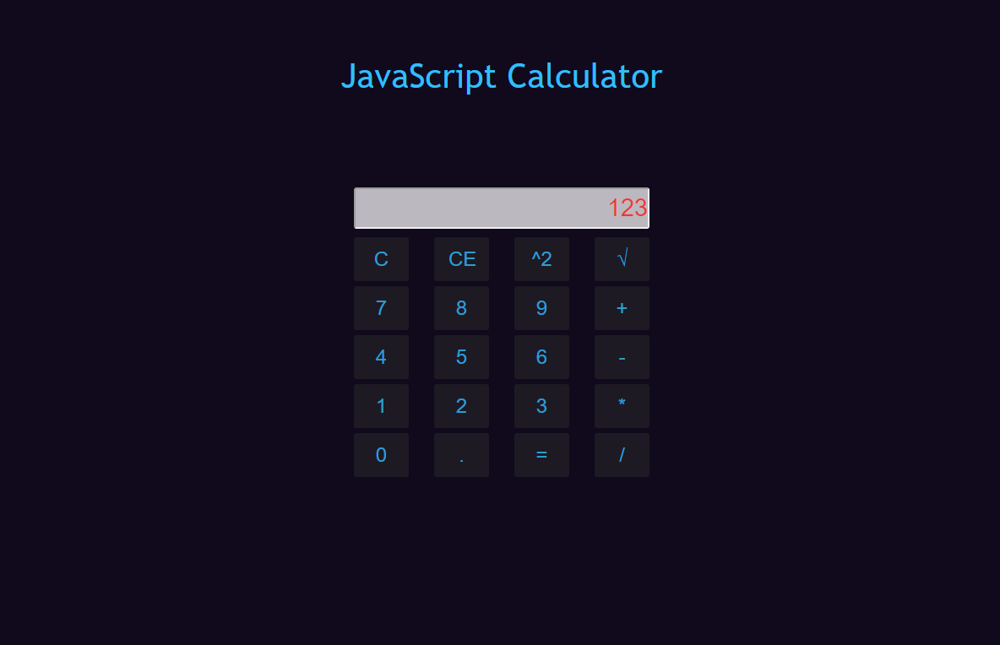

# js-calculator
![License][license-url] ![Version][version-url] ![Done][done-url] ![Maintenance][maintenance-url]

### JavaScript calculator

#### Simple JavaScript calculator built using Bootstrap and Sass.

[license-url]: https://img.shields.io/badge/license-Apache%202-blue.svg?style=flat "License"
[version-url]: https://img.shields.io/badge/version-1.0.0-brightgreen.svg?style=flat "Version"
[done-url]: https://img.shields.io/badge/done-11.2017-yellow.svg?style=flat "Done"
[maintenance-url]: https://img.shields.io/maintenance/no/2017.svg?style=flat "Maintenance"

